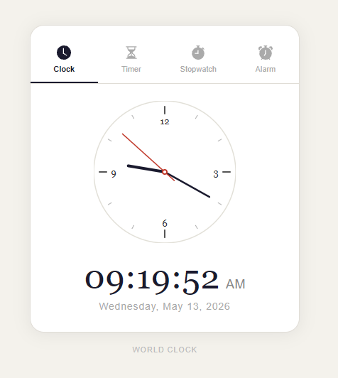
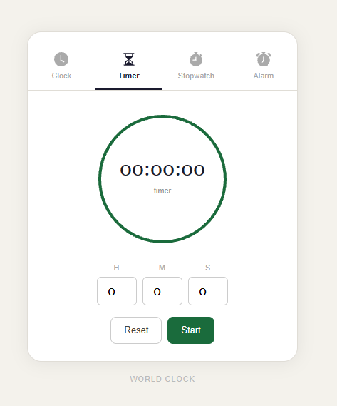
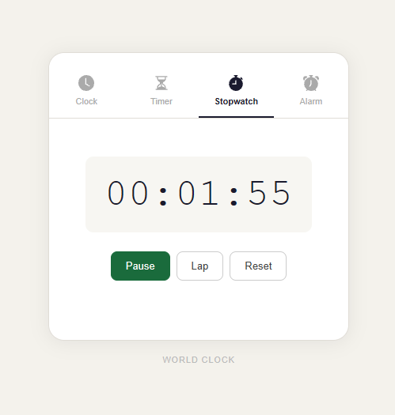
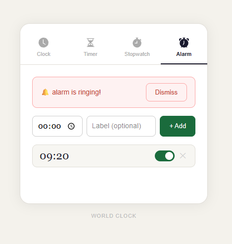

# Modern Clock App built with Next.js

A beautifully designed multi-utility clock application built using **Next.js**, featuring:

- Live Clock
- Timer
- Stopwatch
- Alarm 

<div
  style="
    display: grid;
    grid-template-columns: repeat(2, 1fr);
    gap: 16px;
  "
>
  

  

  

  
</div>

## ✨ Features

### 🕒 Clock Mode
- Displays current time along with date


### ⏳ Timer Mode
- Set custom countdown timers
- Hours / Minutes / Seconds input
- Pause / Resume / Reset support
- Circular progress indicator
- Expiry state tracking


### ⏱ Stopwatch Mode
- Millisecond precision stopwatch
- Start / Pause / Reset controls
- Lap tracking support
- Lap difference calculation
- Dynamic time formattin


### 🔔 Alarm Mode
- Create multiple alarms
- Toggle alarms on/off
- Optional labels for alarms
- Alarm dismissal controls
- Audio playback on trigger


## 🛠 Built With

- React
- Next.js
- TypeScript
- Inline CSS Styling
- HTML Audio API


## 📁 Project Structure

```bash
app/
│
├── components/
│   ├── ClockMode.tsx
│   ├── TimerMode.tsx
│   ├── StopwatchMode.tsx
│   ├── AlarmMode.tsx
│   └── Btn.tsx
│
├── public/
│   └── audio/
│       └── alarm.mp3
│
└── page.tsx
```


## 🚀 Getting Started

### 1. Clone the repository

```bash
git clone <your-repo-url>
```


### 2. Install dependencies

```bash
npm install
```


### 3. Run development server

```bash
npm run dev
```


### 4. Open in browser

```bash
http://localhost:3000
```


## 🎯 Concepts Practiced

This project explores several important frontend concepts:

- React state management
- `useEffect` and intervals
- Stale closures
- Functional state updates
- Audio playback handling
- Time calculations
- Event listeners
- Conditional rendering
- Immutable updates
- Real-time UI synchronization


## 📸 Screens

- Clock dashboard
- Circular timer progress
- Stopwatch with lap history
- Interactive alarm manager


## 🔊 Audio Notes

Alarm sounds are stored inside:

```bash
/public/audio
```

and accessed using:

```ts
new Audio("/audio/alarm.mp3")
```


## ⚠️ Browser Audio Restrictions

Modern browsers only allow audio playback after user interaction.

To ensure alarm playback works correctly:
- interact with the page at least once
- keep tab active when testing alarms


## 🌱 Future Improvements

- Persistent alarms using LocalStorage
- Custom alarm sounds
- Theme switching
- Animated transitions
- Mobile responsive layout
- Pomodoro mode
- Study garden integration
- Notification API support


### Built for learning React, Next.js and timing systems.